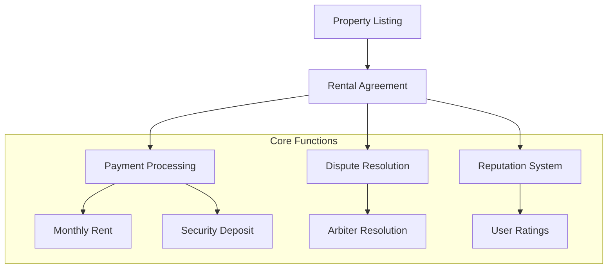

# BlockEstate: Decentralized Property Leasing Protocol

A cutting-edge Web3 rental marketplace built on Stacks blockchain, transforming real estate transactions through smart contract technology.

## Overview

BlockEstate revolutionizes property leasing by eliminating traditional intermediaries and providing a secure, transparent platform for landlords and tenants. By leveraging blockchain technology, we create a trustless environment that ensures fair, efficient rental experiences.

### Key Platform Innovations

- Trustless property listing and leasing mechanism
- Automated rental agreement management
- Secure, transparent payment processing
- Decentralized dispute resolution system
- Reputation-based user verification
- Immutable transaction records

## Architecture



The system consists of several interconnected components:
1. Property Listings Management
2. Rental Agreement Handling
3. Payment Processing
4. Dispute Resolution
5. Reputation System

## Contract Documentation

### Property Listings
- Managed through `property-listings` data map
- Stores property details, pricing, and availability status
- Functions include:
  - `create-listing`
  - `update-listing`
  - `change-listing-status`

### Rental Agreements
- Tracked in `rental-agreements` data map
- Manages active rentals between landlords and tenants
- Key functions:
  - `create-rental-agreement`
  - `pay-rent`
  - `complete-agreement`

### Dispute Resolution
- Handled through `disputes` data map
- Authorized arbiters can resolve conflicts
- Functions:
  - `file-dispute`
  - `resolve-dispute`

### Reputation System
- Stored in `user-reputations` data map
- Tracks user ratings and reviews
- Function: `rate-user`

## Getting Started

### Prerequisites
- Clarinet CLI
- Stacks wallet
- STX tokens for transactions

### Installation
1. Clone the repository
2. Install dependencies with Clarinet
3. Deploy contracts to your chosen network

### Basic Usage

1. **List a Property**
```clarity
(contract-call? 
  .block-estate-marketplace 
  create-property-listing 
  "Urban Loft Retreat" 
  "Sleek downtown studio" 
  "San Francisco, CA" 
  u3500000 ;; 3500 STX per month
  u7000000 ;; 7000 STX deposit
  u3 ;; minimum 3 months
  u18 ;; maximum 18 months
  (list "gym" "coworking" "rooftop")
)
```

2. **Create Lease Agreement**
```clarity
(contract-call? 
  .block-estate-marketplace 
  initiate-lease-agreement 
  u1 ;; property-id
  u150000 ;; lease start block
  u250000 ;; lease end block
  u7000000 ;; security deposit
)
```

3. **Process Rental Payment**
```clarity
(contract-call? 
  .block-estate-marketplace 
  execute-monthly-payment 
  u1 ;; lease-agreement-id
)
```

## Function Reference

### Public Functions

#### Property Management
- `create-listing`: Create new property listing
- `update-listing`: Update existing listing
- `change-listing-status`: Change listing availability

#### Rental Agreements
- `create-rental-agreement`: Start new rental
- `pay-rent`: Process monthly payment
- `complete-agreement`: End rental agreement

#### Dispute Handling
- `file-dispute`: Open new dispute
- `resolve-dispute`: Resolve open dispute

#### Reputation
- `rate-user`: Rate transaction counterparty

### Read-Only Functions
- `get-listing`: Get listing details
- `get-rental-agreement`: Get agreement details
- `get-payment-history`: View payment records
- `get-user-reputation`: Check user ratings

## Development

### Testing
Run tests using Clarinet:
```bash
clarinet test
```

### Local Development
1. Start Clarinet console:
```bash
clarinet console
```
2. Deploy contracts
3. Interact using contract calls

## Security Considerations

### Limitations
- Requires STX for transactions
- Dispute resolution relies on authorized arbiters
- Agreement modifications require new agreement creation

### Best Practices
- Always verify agreement terms before signing
- Keep private keys secure
- Monitor agreement status and payment dates
- Review counterparty reputation before engaging
- Document all communications regarding disputes

### Platform Fees
- Platform charges 2.5% fee on rent payments
- Fees can be adjusted by contract owner
- Maximum fee capped at 10%